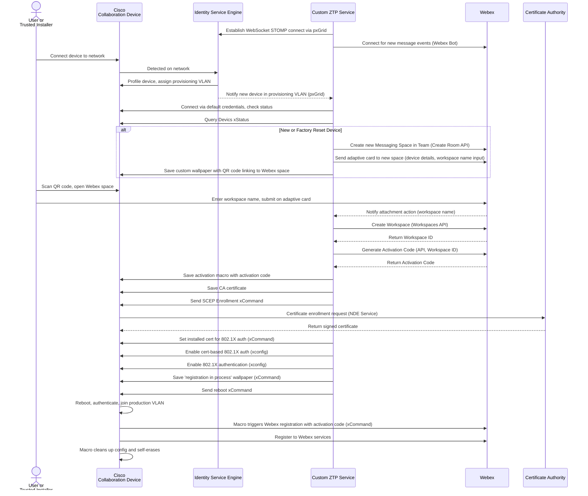

# Zero Trust Secure Provisioning

This is an example Zero Trust Provisioning (ZTP) solution for Cisco Collaboration Devices. The goal of this solution is to reduce dependency on IT resources for Device first time setup by automating Secure Network Onboarding, Workspace Provisioning and Device Activation. This is acomblished by enabling trusted Users or Third Party installers with the abililty to self-provision their Device via a Webex Bot after scanning a QR Code which brings them to a space for that Devices setup.

## Overview

Once a new device has been connected to a corperate network and has been profiled by an ISE Service. The ISE is expected to move the device to an on-boarding VLAN and send the ZTP service a new device provisioning request including the devices IP and MAC Addresses. The ZTP service attempts to connect to the Device using default admin credentials using the provided IP and validates the MAC Address of the device. Once validated, an on-boarding process begins. Refer to the flow diagram below.


### Sequence Diagram




## Setup

### Prerequisites & Dependencies: 

#### Project Enviroment
- NodeJS (version 18.x )
- npm (usually comes with Node.js)

#### Network and Service Requirements
- Webex Org with Admin Access
- RoomOS Device
- Cisco C11XX Router
- Cisco 9XXX Series Switch
- Microsoft AD Certificate Authority

#### Integration Requirements:

- Webex Bot - [Setup Guide](/docs/webexBot.md)

    Required Details:

    - Bot Token
    - Bot ID
    - Bot Email
     
- Webex Team - [Setup Guide](/docs/teamSetup.md)

    Required Details: 

     - Team Id

- Webex Worksapce Integration - [Setup Guide](/docs/workspaceIntegration.md)
    
    Required Details: 

    - Client Id
    - Client Secret
    - Refresh Token
    - Base URL
    - App URL

- Identify Service Engine PxGrid - [Setup Guide](/docs/pxgrid.md)


<!-- GETTING STARTED -->

### Installation Steps:
1.	Clone the repository

    ```
    git clone https://github.com/wxsd-sales/zero-trust-secure-provisioning.git
    cd zero-trust-secure-provisioning
    ```
    
2.	Install dependencies
    ```
    npm install
    ```
3.  Create an environment file
    ```
    cp .env.example .env
    ```
    Open the .env file in your preferred editor and update any configuration values as needed.
4.	Start the service
    ```
    npm start
    ```
    
    
## Demo

<!-- Keep the following statement -->
*For more demos & PoCs like this, check out our [Webex Labs site](https://collabtoolbox.cisco.com/webex-labs).

## License

All contents are licensed under the MIT license. Please see [license](LICENSE) for details.


## Disclaimer

 Everything included is for demo and Proof of Concept purposes only. Use of the site is solely at your own risk. This site may contain links to third party content, which we do not warrant, endorse, or assume liability for. These demos are for Cisco Webex use cases, but are not Official Cisco Webex Branded demos.


## Questions
Please contact the WXSD team at [wxsd@external.cisco.com](mailto:wxsd@external.cisco.com?subject=zero-trust-secure-provisioning) for questions. Or, if you're a Cisco internal employee, reach out to us on the Webex App via our bot (globalexpert@webex.bot). In the "Engagement Type" field, choose the "API/SDK Proof of Concept Integration Development" option to make sure you reach our team. 
